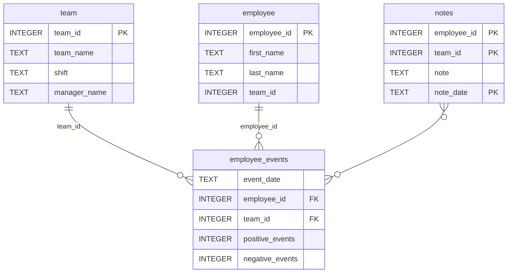

# Software Engineering for Data Scientists 

This repository contains starter code for the **Software Engineering for Data Scientists** final project. Please reference your course materials for documentation on this repository's structure and important files. Happy coding!

# Employee Performance Dashboard 🏢📊

A comprehensive data science project for tracking employee performance and recruitment risk!

## What does this project do? 🤔

This dashboard helps companies:
- Track how well their employees are doing
- See which employees might leave for other jobs
- Monitor team performance
- Make better decisions about their workforce

### Repository Structure
```
├── README.md
├── assets                            # Extra files (AI model, styles)
│   ├── model.pkl
│   └── report.css
├── env
├── python-package.                   # The smart tools that talk to the database
│   ├── employee_events               # Our main package
│   │   ├── __init__.py
│   │   ├── employee.py               # Handles individual employee data
│   │   ├── employee_events.db
│   │   ├── query_base.py             # Basic database functions
│   │   ├── sql_execution.py          # Database connection helper
│   │   └── team.py                   # Handles team data
│   ├── requirements.txt
│   ├── setup.py                      # Instructions for installing our package
├── report                            # The dashboard website
│   ├── base_components               # Reusable website pieces
│   │   ├── __init__.py
│   │   ├── base_component.py
│   │   ├── data_table.py
│   │   ├── dropdown.py
│   │   ├── matplotlib_viz.py
│   │   └── radio.py
│   ├── combined_components
│   │   ├── __init__.py
│   │   ├── combined_component.py
│   │   └── form_group.py
│   ├── dashboard.py                  # Main dashboard application
│   └── utils.py                      # Helper functions
├── requirements.txt                  # List of needed tools
├── start
├── tests                             # Tests to make sure everything works
    └── test_employee_events.py
```

### employee_events.db



## How to set up this project 🛠️

### Step 1: Install the Python Package
```bash
cd python-package
pip install -e .
```

### Step 2: Install Dependencies
```bash
pip install -r requirements.txt
```

### Step 3: Run Tests
```bash
pytest tests/
```

### Step 4: Start the Dashboard
```bash
cd report
python dashboard.py
```

Then visit http://localhost:5001 in your web browser!

## Features ✨

- **Employee Performance Tracking**: See how individual employees are doing
- **Team Analytics**: Monitor entire team performance
- **Recruitment Risk Prediction**: AI-powered predictions of who might leave
- **Interactive Dashboard**: Easy-to-use web interface
- **Real-time Data**: Always up-to-date information

## Technical Details 🔧

- **Backend**: Python with SQLite database
- **Frontend**: FastHTML for quick, responsive web interface
- **AI/ML**: Scikit-learn for recruitment risk prediction
- **Testing**: Pytest for ensuring code quality
- **Architecture**: Object-oriented design with inheritance

## Database Schema 📋

The project uses four main tables:
- `employee`: Basic employee information
- `team`: Team details and management
- `employee_events`: Daily performance events
- `notes`: Manager notes and comments

## Contributing 🤝

1. Fork the repository
2. Create your feature branch
3. Make your changes
4. Run tests to make sure everything works
5. Submit a pull request

## License 📄

This project is licensed under the MIT License - see the LICENSE file for details.

---
